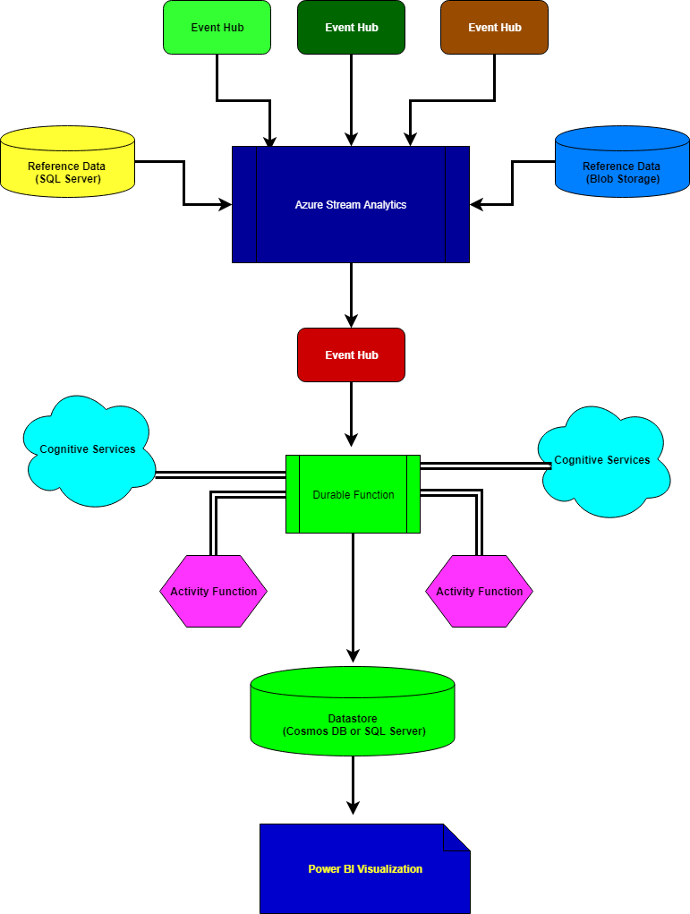

# Data Streams Use Cases
A DataStreams Use Case for processing, aggregating and enriching streaming data using Azure Platform products

## Objective and Background
There are several use cases from Healthcare, Insurance, Retail, Education and Finance where there is a need to pick up continuous streams of data, then filter, process and enrich those data streams from a variety of reference sources, cognitive services and on-prem systems.

In this use case, we are considering scenarios where data is coming from multiple sources and we need to aggregate and process them as the arrive. The processing involves enriching the incoming data with existing reference data from Blob storage and SQL databases. There is also additional processing, filtering and enrichment of the data (using metadata extracted from cognitive services). We may also consider doing the processing, filtering and enrichment from Azure Databricks as well. This scenario relies on Azure Platform services such Blob storage, Event Hub, Azure Functions, Azure SQL Server, Cosmos DB and Cognitive Services.

The final stream can be visualized in real-time using Azure Power BI.

## Resources and Pre-Requisites
For the hack, we will simplify the process of getting started by providing an Ubuntu 16 VM image where the following tools have been installed to reduce the level of effort necessary to get started. Alternatively, you may also install these tools on your machine for local development and debugging:

- Azure CLI 2.0.64 or later
- Python 3.6.8 (or a later version in the 3.6.x series)
- Node.js 10.15.3 or later
- .NET CORE SDK 2.2

## Installation of Resources
There will be example ARM templates and CLI commands to assist with the provisioning and configuration of platform services necessary for this hackathon. Examples are available in the link below:

## Challanges
Challenges for the hack are available in the link below:
